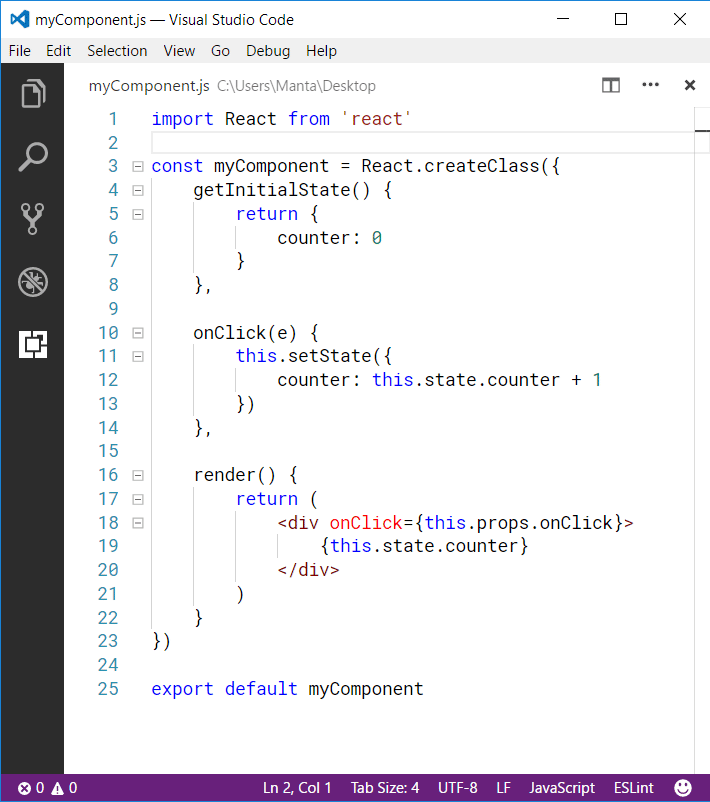

# Usage guide
Simply run **Migrate to React class** command, then re-format the indentation by **Format Document** command.

Note that this command may not work if `React.createClass` is nested in another function.

